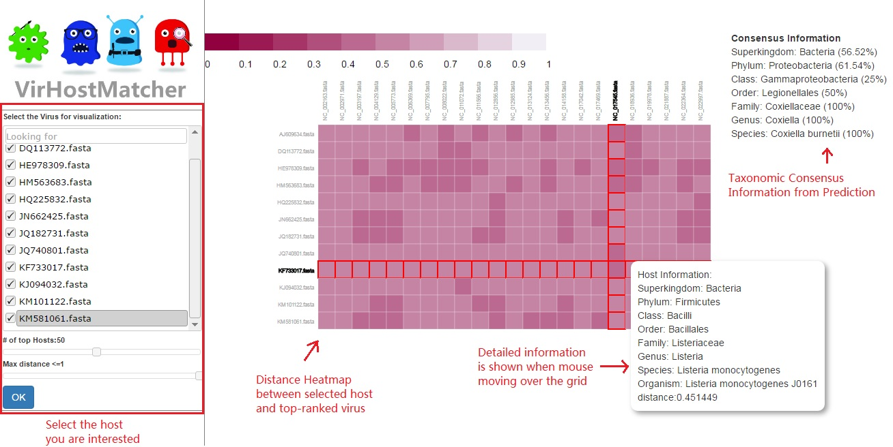

VirHostMatcher: matching hosts of viruses based on oligonucleotide frequency (ONF) comparison
===========

Basic tools for computing various oligonucleotide frequency (ONF) based distance/dissimialrity measures

Requirements
---------------

The source code is written by C++ and wrapped by a python script. Thus it requires python and C++ compiler. It works under Windows, Linux or Mac environment. Precompiled executables are provided for theese three platforms, and users have the optioin of compiling the source code for their specific platform if desired (see the Compilation section below).

Usage
---------------

This program is used to compute various oligonucleotide frequency (ONF) based distance/dissimialrity measures between a pair of DNA sequences. Computing these measures with VirHostMatcher is specifically used to predict the potential host of a query virus by identifying the host to which it has the strongest similarity. Predictions are based on the observation that viruses and hosts often share similar ONF patterns (Ahlgren, Ren et al. submitted). The measures computed by VirHostMatcher include Euclidian distance (Eu), Manhattan distance (Ma), Chebyshev distance (Ch), Jensen-Shannon divergence (JS), d2 dissimilarity, d2\* dissimilarity, d2S dissimilarity, Hao dissimilarity, Teeling dissimilarity, EuF distance and Willner distance. There is also the option to only compute d2* dissimilarity. See paper "Alignment-free d2\* oligonucleotide frequency dissimilarity measure improves accuracy of predicting virus-host interactions" (Ahlgren, Ren et al. submitted) for the definitions. The tool also provides user-friendly visualization of virus-host interactions based on the pairwise distance/dissimilarity between viruses and hosts. 

To use the tool, please simply follow the steps and copy and paste the following commands to the terminal command line. Please do not forget to adjust the path variables to your own (i.e. replace \<Path_to_XXX\> with your own path). 

* Step 1: Download the whole package from https://github.com/jessieren/VirHostMatcher

* Step 2: Prepare a folder containing virus fasta files and a folder containing host fasta files. No subfolders are allowed. All fasta files should be put in the same directory.

* Step 3: Prepare a text file for taxonomy of the hosts. Please follow the format in /test/hostTaxa.txt. (One line for one host sequence and taxon names are tab delimited. There should be no missing taxon name entries, fill these with text such as 'NA' or 'unkown') The host names in the hostTaxa.txt file neet to exactly be the same as the host fasta file names, including the file name extensions otherwise the program cannot correspond the host fasta files and the host taxanomy information. 
	If there is no taxonomy information, a hostTaxa.txt file will be generated in the output directory with all "unknown"s.

* Step 4: Run the program use the following command. 

		python /Path_to_VirHostMatcher/vhm.py -v <Path_to_virus_folder(required)> -b <Path_to_host_folder(required)> -o <Path_to_output(required)> -t <Path_to_hostTaxaFile> -d <1_if_only_compute_d2star>

	For detailed description of the paramter settings,
		python /Path_to_VirHostMatcher/vhm.py --help 

* Congratulations! The results can be find in the output folder. The output folder contains,

	[measure Name]_k[k-tuple length].csv	The dissimilarity/distance matrix for paris of virus and hosts;

	[measure Name]_k[k-tuple length].main.html	The html file for visulization of the virus-host interactions;

	

A test example
---------------

You can find a directory named "test" in the VirHostMatcher package. Two test examples, one small and one large, have been prepared for users. The small test set named "toyexample" contains the 12 viruses and 23 hosts. The larger test set named "352virus" contains 352 viruses and 71 hosts, which is the dataset used in the Figure 1 of the paper. 
For each of the two test data, there are three folders, "virus", "host" and "output" and one file "hostTaxa.txt". 
The folder "virus" contains the virus fasta files, "host" contains the host fasta files, and "output" contains all the output results where the distance matrix files (".csv") and visualization files (".html") can be found. The file hostTaxa.txt lists the taxonomy information of the host species. To run the program with the test data, use the following command after adjusting the path variables to your own (i.e. replace \<Path_to_XXX\> with your own path). 

	python /Path_to_VirHostMatcher/vhm.py -v /Path_to_VirHostMatcher/test/toyexample/virus -b /Path_to_VirHostMatcher/test/toyexample/host -o /Path_to_VirHostMatcher/test/toyexample/output -t /Path_to_VirHostMatcher/test/toyexample/hostTaxa.txt
	
	python /Path_to_VirHostMatcher/vhm.py -v /Path_to_VirHostMatcher/test/352virus/virus -b /Path_to_VirHostMatcher/test/352virus/host -o /Path_to_VirHostMatcher/test/352virus/output -t /Path_to_VirHostMatcher/test/352virus/hostTaxa.txt

Visualization
---------------

VirHostMatcher provides a convenient way to visualize and analyze output result through browser. In particular, for each distance/dissimialrity measure, a corresponding webpage named '[measure Name]_k[k-tuple length].main.html' will be generated under the output folder. For example, 'Hao_k6_main.html' for the case of d2star dissimilarity when k=6. The visualization mainly contains three parts: (1) select the interested virus to manipulate from the left panel; (2) plot the distance heatmap between interested virus and top-ranked host in the middle. Users can further look at detailed information by moving the mouse over the corresponding grid; (3) The taxonomic consensus information is summarized in the right. 

  

	

Compilation
------------
VirHostMatcher has prepared executable (compiled) programs under \<Path_to_VirHostMatcher/bin\> for three main operating systems, Linux, Window and Mac. VirHostMatcher automatically detects the operating system and uses the corresponding compiled programs. 
For running on other operating systems, VirHostMatcher will automatically attempt compile the source code for your platform by running the Makefile in bin/ folder.
If users desire, the source code and Makefile are provided for compilation on their particular machine. VirHostMatcher can be compiled by running 'make' at the command line under the main directory. When using this option the Makefile will compile the source code into executable files into the main folder \<Path_to_VirHostMatcher\> which then will be detected and used by the main python script.

Contacts and bug reports
------------------------
Jie Ren
renj@usc.edu

Yang Lu
ylu465@usc.edu 

Nathan Ahlgren
ahlgren@usc.edu 

Fengzhu Sun
fsun@usc.edu

If you found a bug or mistake in this project, we would like to know about it.
Before you send us the bug report though, please check the following:

1. Are you using the latest version? The bug you found may already have been
fixed.
2. Check that your input is in the correct format and you have selected the
correct options.
3. Please reduce your input to the smallest possible size that still produces
the bug; we will need your input data to reproduce the problem, and the
smaller you can make it, the easier it will be.

Copyright and License Information
---------------------------------
Copyright (C) 2016 University of Southern California, Jie Ren

Authors: Jie Ren, Yang Lu

This program is free software: you can redistribute it and/or modify it under
the terms of the GNU General Public License as published by the Free Software
Foundation, either version 3 of the License, or (at your option) any later
version.

This program is distributed in the hope that it will be useful, but WITHOUT
ANY WARRANTY; without even the implied warranty of MERCHANTABILITY or FITNESS
FOR A PARTICULAR PURPOSE. See the GNU General Public License for more details.

You should have received a copy of the GNU General Public License along with
this program. If not, see http://www.gnu.org/licenses/.
